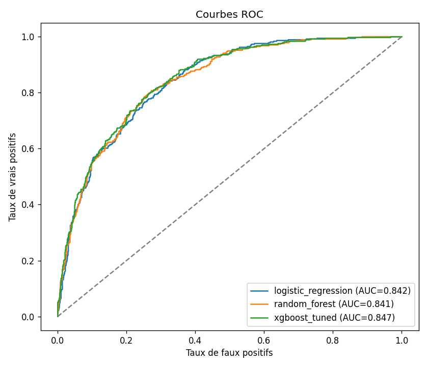
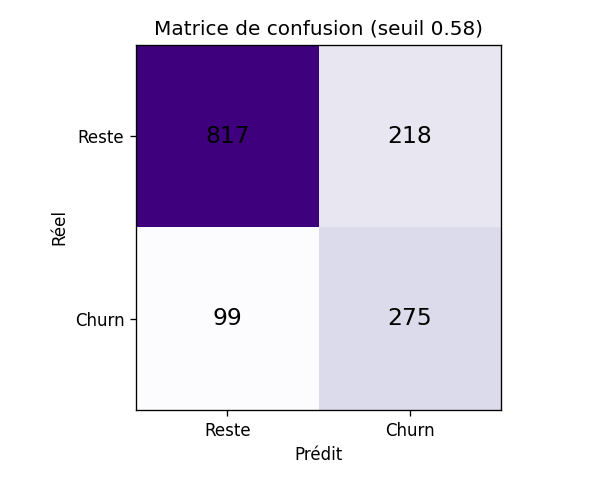

# 📉 Prédiction du churn client (Telco)

Modèle de Machine Learning identifiant les **clients à risque de résiliation** d'un opérateur télécom, afin de cibler les actions de rétention. Le projet couvre toute la chaîne : nettoyage, préparation, gestion du déséquilibre de classes, comparaison de modèles, tuning et optimisation du seuil de décision.

> Dataset : [IBM Telco Customer Churn](https://www.kaggle.com/datasets/blastchar/telco-customer-churn) — 7 043 clients, 21 variables, taux de churn **26,5 %** (classes déséquilibrées).

## 🎯 Résultats

Évaluation sur 20 % des clients (jeu de test stratifié). En rétention, la métrique clé est le **recall** (part des vrais churners détectés) et la **ROC-AUC**, l'accuracy étant trompeuse sur des classes déséquilibrées.

| Modèle | ROC-AUC | Recall | Précision | F1 |
|---|---|---|---|---|
| **XGBoost (tuné)** ⭐ | **0.847** | 0.80 | 0.53 | 0.63 |
| Régression logistique | 0.842 | 0.78 | 0.50 | 0.61 |
| Random Forest | 0.841 | 0.78 | 0.53 | 0.63 |
| XGBoost | 0.837 | 0.77 | 0.53 | 0.63 |
| XGBoost + SMOTE | 0.836 | 0.60 | 0.58 | 0.59 |




**Choix méthodologiques (et honnêteté sur les résultats) :**
- **Déséquilibre** géré par pondération (`class_weight` / `scale_pos_weight`). Le **SMOTE a été testé mais n'apporte rien** ici (ROC-AUC 0,836, recall dégradé) → la pondération suffisait.
- **Tuning** par `GridSearchCV` (scoring ROC-AUC) → gain de 0,842 à **0,847**. Le plafond du Telco Churn se situe autour de 0,85, donc la marge est faible : le travail utile est surtout métier (seuil, features).
- **Seuil de décision optimisé** (F1) à **0,58**. Ce seuil est ajustable selon le coût métier : un faux négatif (churner raté) coûte généralement plus cher qu'un faux positif (offre de rétention envoyée pour rien) → on peut l'abaisser pour augmenter le recall.

## 🧠 Approche

1. **Nettoyage** (`main/processing.ipynb`) : traitement des `TotalCharges` manquants, encodage des variables, scaling.
2. **Pipeline complet** (`src/train_model.py`) : `ColumnTransformer` (One-Hot + StandardScaler) + modèle, entièrement réutilisable pour l'inférence.
3. **Comparaison** de 4 approches + version SMOTE, **tuning** GridSearch, **optimisation du seuil**.
4. **Sauvegarde** du meilleur pipeline, des métriques et des visualisations.

## 📁 Structure

```
Churn-prediction/
├── data/
│   ├── raw/                 # Dataset brut IBM Telco
│   └── processed/           # Données nettoyées et prêtes pour le ML
├── main/                    # Notebooks : preprocessing + exploration modèles
├── src/train_model.py       # ⭐ Pipeline d'entraînement (tuning, SMOTE, seuil)
├── models/                  # churn_model.joblib + metrics.json + feature_schema.json
├── reports/                 # Courbes ROC, matrice de confusion
├── streamlit_app.py         # Application web (prédicteur de churn)
└── requirements.txt
```

## 🚀 Installation & utilisation

```bash
git clone https://github.com/2Alexis/Churn-prediction.git
cd Churn-prediction
pip install -r requirements.txt

python src/train_model.py        # (ré)entraîne le modèle
streamlit run streamlit_app.py   # lance l'application
```

## 🛠️ Stack

Python · pandas · scikit-learn · XGBoost · imbalanced-learn · Streamlit · matplotlib

## 👤 Auteur

**Alexis Clerc** — Étudiant en Bachelor Informatique spécialisé IA & Data
[GitHub](https://github.com/2Alexis) · [Portfolio](https://alexis-clerc.fr)
